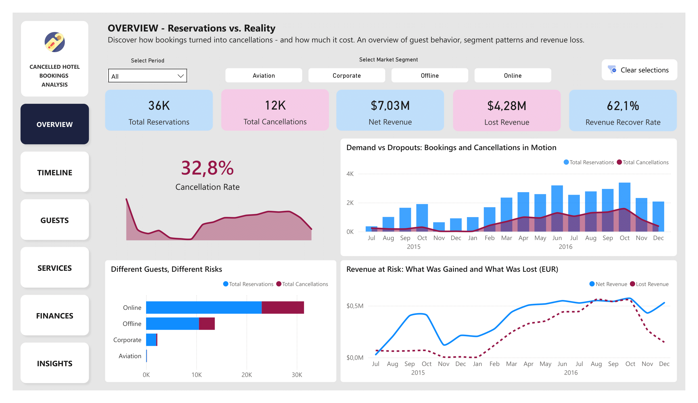
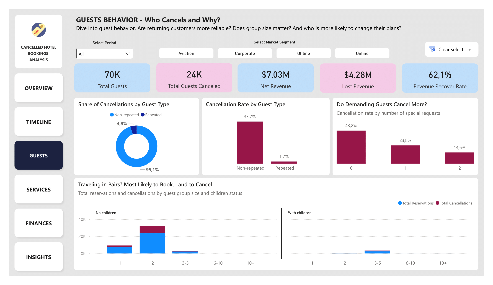
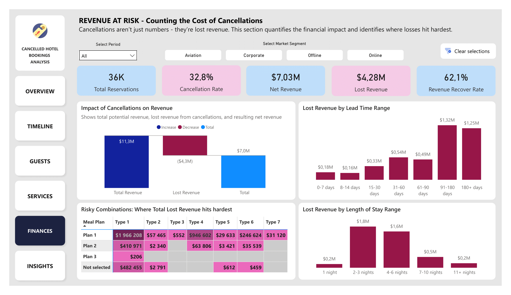
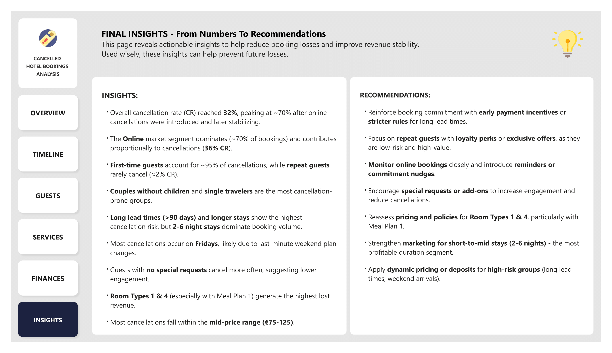

# Hotels Cancellations Trends Analysis

## Project Overview  
At the start of the analyzed period (July 2015 - December 2016), the two largest hotels of the Tardigrade Inn chain introduced online booking cancellations. Management and revenue teams wanted to understand cancellation patterns, quantify their financial impact, and identify actionable ways to reduce losses.

This analysis aimed to explore how online cancellations affected booking behavior and revenue, and to provide clear, actionable insights for operational and marketing decision-making. Data was prepared and explored in SQL (details in the SQL folder), with key findings visualized in a six-page interactive Power BI report.

## Power BI Report and Findings
The final report includes six themed pages, each exploring booking and cancellation dynamics from a different perspective:

1. **Overview** - trends in bookings, cancellations, and revenue
2. **Timeline** - seasonality, weekdays, lead time, and length of stay patterns
3. **Guests** - guest types and cancellation behavior
4. **Services** - room types, meal plans, and special requests impact  
5. **Finances** - revenue losses and financial impact of cancellations
6. **Insights** - summary and actionable recommendations

## View the live dashboard: 
👉 [Live interactive dashboard link here](https://app.powerbi.com/view?r=eyJrIjoiNjU4ZDc4N2UtYWJjZS00NzU0LWE4ZDUtMjRiMTUxYzMyMzUwIiwidCI6IjE1YzIyNjQ2LTU5M2YtNDMxOC04NTYzLTMwZmU5ZmRmMDdjZSJ9)

Static preview of each page:

| Overview | Timeline |
|--------|--------|
|  |  |

| Guests | Services |
|--------|--------|
|  |  |

| Finances | Insights |
|--------|--------|
|  |  |

## Key Insights
The analysis revealed clear behavioral patterns behind hotel booking cancellations, identifying who, when, and under what circumstances cancellations are most likely to occur.

### Overall Trends
On average, around one-third of all reservations were cancelled.
Cancellations initially peaked (~70%) when online cancellations were introduced, then stabilized around 32–40%, with a slight decline toward the end of the analyzed period.
In 2016, cancellations accounted for over $4M in potential lost revenue, with only ~60% recovered.

### Market Segments & Guest Behavior
The Online market segment accounted for nearly 70% of bookings and contributed proportionally to cancellations.
Other segments (Offline, Corporate, Aviation) show varied presence and profitability; cancellations occur across all of them, but volume and revenue impact differ.
First-time guests account for ~95% of cancellations; repeat guests rarely cancel (~2% CR).
Couples without children and single travelers are the most cancellation-prone groups.
Guests with no special requests show higher cancellation rates, suggesting lower engagement.

### Time Dimension
Long lead times (>3 months) significantly increase cancellation risk, particularly for longer stays. Cancellations with long lead times caused the largest financial impact (~$2.5M potential loss).
Fridays are the peak day for cancellations for the largest market segments (Online & Offline), suggesting last-minute weekend plan changes.
Corporate segment shows a different pattern: most cancellations occur early in the week (Tue–Thu), reflecting its business-travel nature.

### Guest Dimension
First-time guests account for ~95% of all cancellations, while repeat guests rarely cancel (≈2% CR).
Couples without children are the largest group prone to cancel (~35%), followed by single travelers (~24%).
Guests with no special requests cancel significantly more often (~43% CR), suggesting lower engagement and commitment.

### Services & Revenue Impact
Room Types 1 & 4 generate the highest lost revenue, particularly when paired with Meal Plan 1 (mid-range prices: $75–125).
The Room Type 1 + Meal Plan 1 combination alone accounts for nearly $2M in lost revenue.
The mid-price range dominates both bookings and cancellations across all segments; cheaper rooms are slightly more popular in Corporate but with lower revenue impact.
 
## Recommendations
- Focus marketing efforts on the Online market segment, as it drives the majority of revenue.
- Reinforce booking commitment with early payment incentives or stricter cancellation rules, especially for long lead times.
- Introduce loyalty perks or exclusive offers for repeat guests, a low-risk, high-value group.
- Monitor online cancellations across all segments and implement reminders or commitment nudges.
- Encourage special requests or add-ons to increase engagement and reduce cancellations.
- Reassess pricing and cancellation policies for Room Types 1 & 4, particularly with Meal Plan 1.
- Promote short-to-mid stays (2–6 nights) to maximize revenue in the most popular segment.
- Apply dynamic pricing or deposits for high-risk bookings (long lead times, weekend arrivals).
- Consider longer-term trend analysis if future data extends beyond 1.5 years.

## Strategic Focus
The insights and recommendations provide a clear operational roadmap, but they can also be viewed through a strategic lens. When interpreting the findings, two complementary approaches can guide business priorities:

### Minimizing Losses
Focus on high-risk groups, long lead times, and segments with elevated cancellation rates. Implement measures to reduce cancellations and recover potential revenue, particularly in mid-range and financially impactful combinations (e.g., Room Type 1 + Meal Plan 1).

### Maximizing Gains
Identify the most profitable and stable segments, such as loyal repeat guests or popular booking patterns, and invest in strategies that encourage their continued engagement and increased spend. Optimizing these high-value segments can amplify overall revenue while maintaining a controlled cancellation risk.

By balancing these two approaches, the hotel can both protect revenue from predictable risks and capitalize on growth opportunities, ensuring data-driven decision-making that aligns with broader business goals.

## Technical summary

### Technologies used:
- **MS SQL Server** - data cleaning and exploratory analysis
  
  See full SQL here: [SQL scripts](./sql)   
- **Power BI** - interactive report design, visual storytelling  

### Repository Structure
- `data/` - folder containing raw dataset:
  - `raw_data.csv` - source data file
- `sql/` - folder containing SQL scripts:
  - `data_cleaning.sql` - SQL script for data cleaning
  - `exploratory_data_analysis.sql` - SQL queries for exploratory data analysis
- `powerbi/` - folder with Power BI file:
  - `report.pbix` - fully interactive report file
  - `preview/` - image preview of each report page
- `README.md` - project documentation

